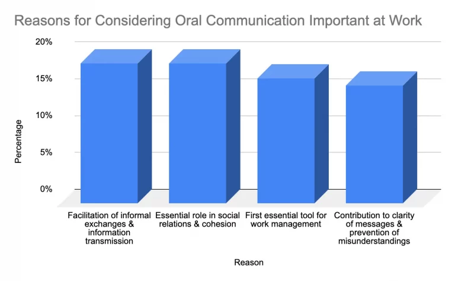
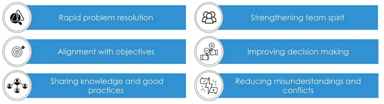

Otherwise, why be interested in the subject of Oral Culture? Let's take a few real-life situations:

* We realize that sometimes we have had to make important decisions, which we have not documented. Which makes it difficult to track who decided what, and why.  
* We attend a meeting where we discuss a new project, but we leave with more questions than answers. Information seems to get lost along the way between the different people involved, and we're not sure what we're supposed to do.  
* We notice that those who are more extroverted are always aware of the latest news and important decisions, while those who are more reserved or introverted seem to be left out of the loop.  
* Every week, we have so many meetings that we don't have time to concentrate on our real work. We spend more time in meetings than in front of our computer moving projects forward.  
* We recently joined this company, but we struggle to understand the ins and outs of its projects. It seems that a lot of important information is passed on simply by word of mouth, and we feel left out because we don't know everything.  
* We have been assigned to take over the work of a colleague who has just left, but we feel completely overwhelmed. There is no documentation of what he actually did, and we now have to spend hours trying to understand how he managed his tasks.

The desire to understand the specificities of such a culture, its advantages and drawbacks and its impact on the performance of a company, pushes me to share this with you.

#### Some key figures to start

French employees attach great importance to oral communication. A study, conducted by Occurrence and published by Mediameeting, exploring employees' expectations regarding oral communication, highlights the perceived strengths of orality within companies as well as the opportunities it offers to these last.

We learn that 93% of employees consider oral communication important at work, with 54% even considering it very important.

Four reasons are given to explain this importance:

Oral communication in business can bring many benefits, but it also requires careful management to maximize its effectiveness and minimize risks. It can lead to errors, delays and loss of effectiveness if it is unclear. It can lead to loss of crucial information if not followed by proper documentation. The oral (synchronous) transmission of information within an organization requires encounters between individuals and can strongly impact their time management.

So while Oral culture can improve collaboration and creativity, it is crucial to find a balance with other forms of communication.

#### Oral culture is so present in our companies. What are the reasons explaining this?

Fostering open oral communication within an organization has many benefits, including:

This allows:

* Team members to quickly discuss issues encountered, identify potential solutions, and take immediate corrective action.
* Team members to have a better understanding of the project objectives, the company’s priorities and the expectations of their colleagues. This promotes overall alignment and a focus of effort on the most important tasks.
* Teams to share their knowledge, experiences and best practices.
* To create a work environment where employees feel free to express their ideas, concerns and suggestions without fear of judgment. This fosters a sense of team belonging, builds mutual trust and encourages collaboration.
* To make more informed and considered decisions. Different points of view can be discussed and evaluated, leading to more informed and accepted decisions.
* To clarify expectations, avoid misinterpretations and resolve misunderstandings before they become conflicts.Team members can clearly communicate their intentions, concerns and opinions, reducing friction and promoting a harmonious work environment.

In addition, Oral communication benefits from the contribution of agile methodologies, such as Scrum and Kanban. These methodologies offer structuring around practices such as daily meetings or retrospectives. Additionally, online communication tools, such as Slack or Microsoft Teams, facilitate remote exchanges.

AI is improving this communication. Features like machine translation, meeting transcription, and sentiment analysis can help facilitate communication between multicultural teams.

#### Yes, but it doesn’t only have advantages
Oral communication requires encounters between individuals (physical or virtual). These meetings can be planned or spontaneous.

In a business where employees operate in a distributed organization, scheduled meetings can be a significant waste of time. While these can be helpful, when they are automatically used, they inadvertently create a fragmented team schedule.

Spontaneous meetings make the schedule heavily interrupted, which can significantly harm productivity for employees who need time to concentrate on in-depth work.

Documentation is strongly impacted by the way it communicates and shares information. Verbal communication suffers from its shortcomings:
* **Lack of precision:** Oral communication can sometimes be imprecise, as details can be misunderstood or misinterpreted when conveyed verbally. This may result in incorrect or incomplete information.
* **Risk of distortion:** Information exchanged verbally can be distorted over time, where details are changed as they are passed from one person to another. This may compromise the reliability and accuracy of documented information.
* **Difficulty of referencing:** Unlike written documents that can be easily referenced and found, it can be difficult to track down specific information that was shared verbally. This can make finding accurate information more laborious and time-consuming.
* **Limiting the scope:** Oral communication is generally limited by the number of people present when the information is transmitted. This can make it difficult to effectively disseminate knowledge to large numbers of people or remote teams.
* **Dependence on human memory:** Oral communication relies on the ability of individuals to remember the information exchanged. However, human memory is prone to forgetting and distortion, which can compromise the reliability of shared information.
* **Language and cultural barriers:** Linguistic and cultural differences between members of an organization can lead to misunderstandings during oral communication. This can make accurate documentation and transmission of information difficult in a multicultural context.
### And for optimal balance
By combining Oral and Written communication wisely, we can create a more effective work environment, where information is shared clearly, errors are reduced and collaboration is fostered.

Verbal discussions can be followed by written documentation that summarizes key points, reducing the risk of misunderstandings or forgetting.

Writing remains very important, particularly in our IT organizations. Documentation is the key to addressing issues such as:

* Capitalizing on knowledge and sharing good practices.
* Effective integration of new members and continuing training.
* Clear specification of needs to minimize errors and make dev teams autonomous in execution.
* Standardization of practices to guarantee consistency in company processes.
* Formalization of architectural decisions to explain the context, the problem to be solved, the possible options, the choice and its impacts.

#### References :

- [https://occurrence.fr/newsletter/wp-content/uploads/2021/02/CP_etude-Occurrence-Mediameeting-janvier-2021.pdf](https://occurrence.fr/newsletter/wp-content/uploads/2021/02/CP_etude-Occurrence-Mediameeting-janvier-2021.pdf)
- [https://edokumassoupwith.wordpress.com/2022/03/05/pourquoi-la-culture-de-lecrit-doit-prendre-le-pas-sur-loral-dans-votre-startup/](https://cedricmesas.com/2022/03/05/pourquoi-la-culture-de-lecrit-doit-prendre-le-pas-sur-loral-dans-votre-startup/)
- [https://www.infoq.com/articles/asynchronous-collaborations-software-teams/](https://www.infoq.com/articles/asynchronous-collaborations-software-teams/)
